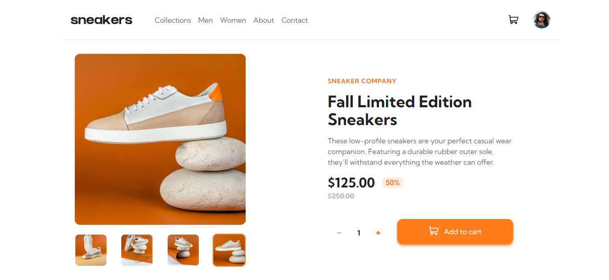
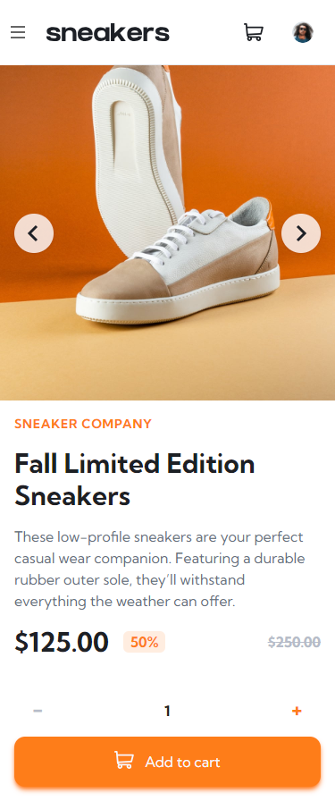
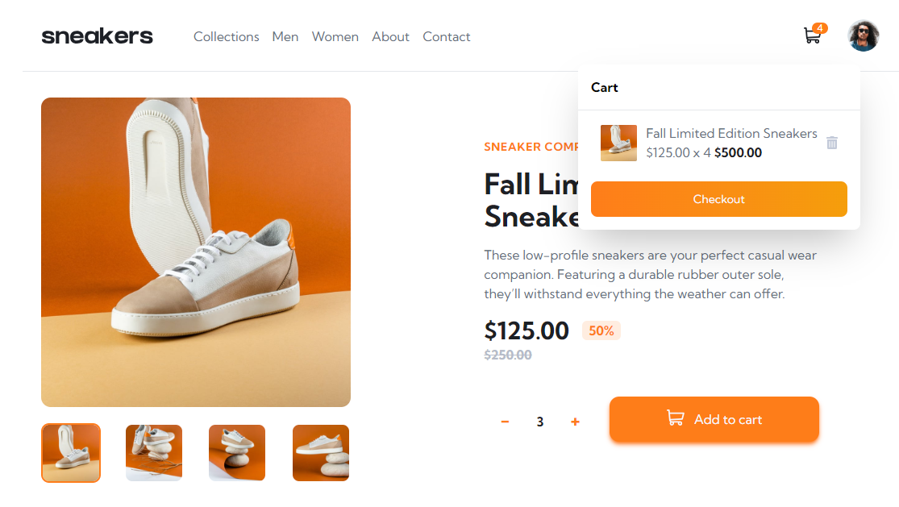
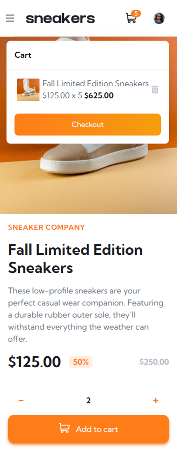

# Frontend Mentor - E-commerce product page solution

This is a solution to the [E-commerce product page challenge on Frontend Mentor](https://www.frontendmentor.io/challenges/ecommerce-product-page-UPsZ9MJp6). Frontend Mentor challenges help you improve your coding skills by building realistic projects.

## Table of contents

- [Overview](#overview)
  - [The challenge](#the-challenge)
  - [Screenshot](#screenshot)
  - [Links](#links)
- [My process](#my-process)
  - [Built with](#built-with)
  - [What I learned](#what-i-learned)
  - [Continued development](#continued-development)
  - [Useful resources](#useful-resources)
- [Author](#author)

## Overview

### The challenge

Users should be able to:

- View the optimal layout for the site depending on their device's screen size
- See hover states for all interactive elements on the page
- Open a lightbox gallery by clicking on the large product image
- Switch the large product image by clicking on the small thumbnail images
- Add items to the cart
- View the cart and remove items from it

### Screenshot

### Links

- Solution URL: [Add solution URL here](https://github.com/martinorue/fem-product-page)
- Live Site URL: [Add live site URL here](https://fem-product-page-eight.vercel.app/)

## My process

In this challenge, I set out to use Tailwind and TypeScript, which are tools I've been delving into recently. The experience with Tailwind was very satisfying, and I plan to continue using it. In TypeScript, I have my doubts about whether I'm following the best practices, but I put in my best effort to achieve it and I will continue to study it more thoroughly to get the most out of it.

While I had already used Custom Hooks and Context in React for my solution to the [Todo app](https://www.frontendmentor.io/solutions/todo-app-using-react-6CigAWdga5), this time I also decided to put them into practice. For example, I used Context for managing the cart, although I did this with more of a future-oriented mindset, thinking about a more 'real' application where I might need to access the cart from other parts of my application.

Regarding the Custom Hooks, I implemented one for cart functionalities and another for being able to close the cart, the navigation menu, and the product modal when clicking outside. My idea was to avoid repeating the code in every place I wanted to implement this functionality.

### Built with

- [React](https://reactjs.org/) - JS library
- [TypeScript](https://www.typescriptlang.org/)
- [Tailwind](https://tailwindcss.com/)
- Mobile-first workflow

**Note: These are just examples. Delete this note and replace the list above with your own choices**

### What I learned

I learned that it's not recommended to nest a `<nav>` element within a `<header>` element. 

I discovered the importance of self-hosting web fonts for better web performance.

How to create a hamburger menu.

How to use window.innerWidth property in React to dynamically adapt your user interface, such as hiding/showing the hamburger icon and navigation items based on the window width.

How to create a carousel component using only ReactJS and TailwindCSS, without relying on external libraries.

How to implementing a shopping cart using React and TypeScript. I utilized Context to manage the shopping cart's state and display a badge indicating the quantity of products in the cart.

I leveraged Headless UI to modify a modal component and create an overlay carousel.

### Continued development

I would like to take all this learning and apply it to the creation of a more comprehensive and realistic e-commerce solution

### Useful resources

- [Don't nest `<nav>` inside `<header>`](https://dev.to/masakudamatsu/don-t-nest-nav-inside-header-do-nest-the-hamburger-menu-button-inside-nav-6cp) - I wasn't shure to nest a `<nav>` inside a `<header>` and I found this great article that cleared up my doubts

- [Why You Should STOP Using Google Fonts (And How to Self-Host Your Own Web Fonts)](https://youtu.be/363s_ziVwTg) - I found this great resource while learning about web performance. Here you can understand why you should self-host your web fonts and how to do so

- [Hamburger Menu with a Side of React Hooks and Styled Components](https://css-tricks.com/hamburger-menu-with-a-side-of-react-hooks-and-styled-components/) - I used this tutorial as a guide to create the hamburger menu. Even though I've never used styled-components, it wasn't difficult to figure out what's going on.

- [How to Get the Window’s Width and Height in React](https://codingbeautydev.com/blog/react-get-window-width-height/) - I made use of this `window.innerWidth` property to hide and show the hamburger icon and show navigation items in desktop view

- [Build a Carousel Component like Instagram purely in ReactJS and TailwindCSS](https://www.youtube.com/watch?v=XJSOgV4VELk) - I followed this tutorial to create a carousel without libraries

- [How To Create An Advanced Shopping Cart With React and TypeScript](https://www.youtube.com/watch?v=lATafp15HWA&t=2293s) - I used this tutorial as a guide to applying Context to the shopping cart and thus being able to display the badge indicating the quantity of products in the cart.

- [Modal component](https://headlessui.com/) - I used Headless UI to make the overlay carousel by modifiyng a modal component

## Author

- Website - [Martín Orue](https://martin-orue-portfolio.vercel.app/)
- Frontend Mentor - [@martinorue](https://www.frontendmentor.io/profile/martinorue)